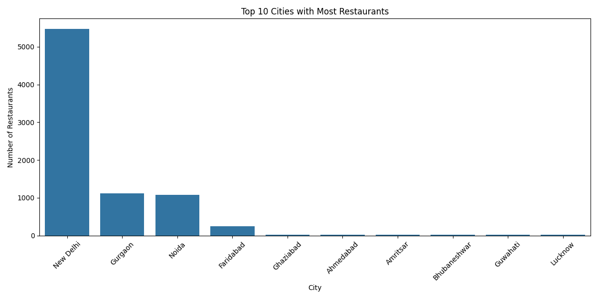
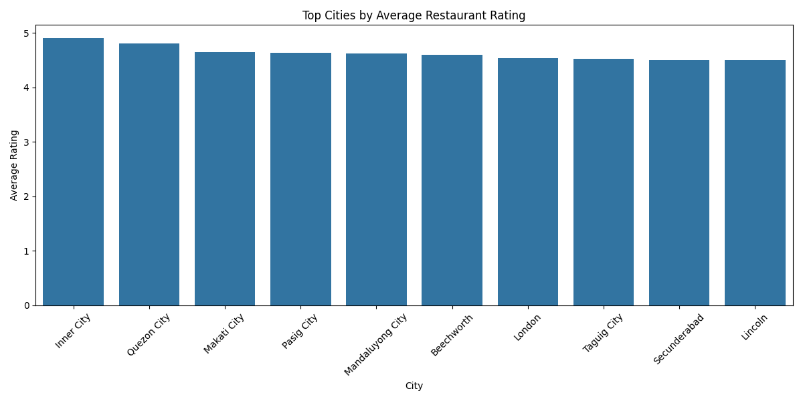
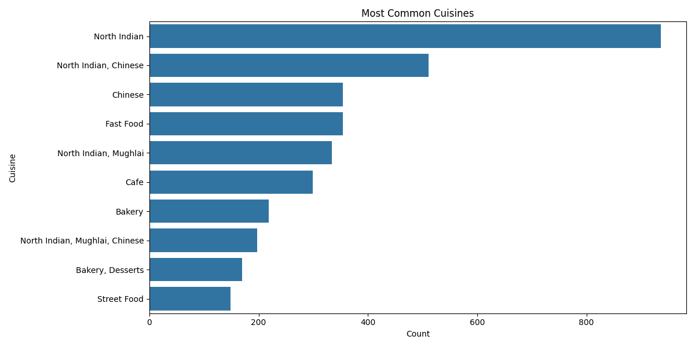

# Task 4: Restaurant Location-Based Analysis

## 📌 Overview

This project focuses on performing a geographical and statistical analysis of restaurants using location-based data such as latitude, longitude, city, cuisines, ratings, and price ranges.

The analysis helps in understanding:
- restaurant distribution across cities
- popular cuisines
- highly rated locations
- pricing trends
- restaurant concentration patterns

The project also includes an interactive restaurant map built using Folium.

---

#  Objective

The main objective of this project is to Perform a geographical analysis of the restaurants in the dataset.

---

#  Technologies Used

- Python
- Pandas
- Matplotlib
- Seaborn
- Folium

---

# 📂 Dataset Information

The dataset contains restaurant-related information such as:

| Feature | Description |
|---|---|
| Restaurant Name | Name of restaurant |
| City | Restaurant location |
| Latitude | Geographic latitude |
| Longitude | Geographic longitude |
| Cuisines | Cuisine types |
| Aggregate Rating | Customer rating |
| Price Range | Restaurant pricing category |

Dataset Size:
- 9551 restaurants
- 21 features

---

# 🔄 Project Workflow

## Step 1 — Data Loading

The dataset was loaded using Pandas and basic information about the data was explored.

---

## Step 2 — Restaurant Distribution Analysis

Restaurants were grouped by city to identify:
- cities with the highest restaurant concentration
- distribution trends

---

## Step 3 — Rating Analysis

Average restaurant ratings were calculated city-wise to identify highly rated restaurant locations.

---

## Step 4 — Price Range Analysis

The average price range of restaurants was analyzed across cities.

---

## Step 5 — Cuisine Analysis

The most common cuisines in the dataset were identified and visualized.

---

## Step 6 — Geographical Mapping

An interactive restaurant map was created using Folium with restaurant markers plotted using:
- latitude
- longitude coordinates

---

# 📊 Visualizations Generated

The following visualizations were created:

| Visualization | File Name |
|---|---|
| Top Cities with Most Restaurants | top_cities.png |
| Average Ratings by City | city_ratings.png |
| Most Common Cuisines | common_cuisines.png |
| Interactive Restaurant Map | restaurant_map.html |

---

#  Output Screenshots

## Top 10 Cities with Most Restaurants



---

## Average Ratings by City



---

## Most Common Cuisines



---

#  Interactive Restaurant Map

An interactive map was generated using Folium.

Open the following file in your browser:

```text
restaurant_map.html
```

The map displays restaurant locations worldwide with clickable restaurant names.

---

#  Key Insights

## Top Cities with Most Restaurants

| City | Restaurant Count |
|---|---|
| New Delhi | 5473 |
| Gurgaon | 1118 |
| Noida | 1080 |

New Delhi contains the highest number of restaurants in the dataset.

---

## Highest Rated Cities

| City | Average Rating |
|---|---|
| Inner City | 4.9 |
| Quezon City | 4.8 |
| Makati City | 4.65 |

These cities have some of the highest-rated restaurants.

---

## Most Common Cuisines

| Cuisine | Count |
|---|---|
| North Indian | 936 |
| North Indian, Chinese | 511 |
| Chinese | 354 |

North Indian cuisine is the most common cuisine in the dataset.

---

#  What I Learned

Through this project, I learned:
- geographical data analysis
- data visualization techniques
- interactive mapping using Folium
- grouping and aggregation in Pandas
- statistical analysis of restaurant data

---

#  Advantages

- Helps identify restaurant concentration areas
- Provides location-based business insights
- Interactive and visually informative
- Useful for business and market analysis

---

#  Limitations

- Limited to available dataset locations
- Does not include real-time restaurant updates
- Map visualization may become crowded with very large datasets

---

#  Future Improvements

Possible future enhancements:
- Heatmap visualization
- Real-time restaurant tracking
- Cluster analysis of restaurant locations
- Dashboard creation using Streamlit or Power BI
- Advanced geographical analytics


---

# 📁 Project Structure

```text
task4/
│
├── Dataset.csv
├── task4.py
├── README.md
├── restaurant_map.html
│
├── screenshots/
│   ├── top_cities.png
│   ├── city_ratings.png
│   └── common_cuisines.png
```

---

# Conclusion

This project successfully performed location-based analysis on restaurant data using visualization and geographical mapping techniques.

The analysis provided useful insights about:
- restaurant distribution
- popular cuisines
- city-wise ratings
- pricing patterns

The interactive restaurant map added a practical geographical understanding of restaurant locations.

---